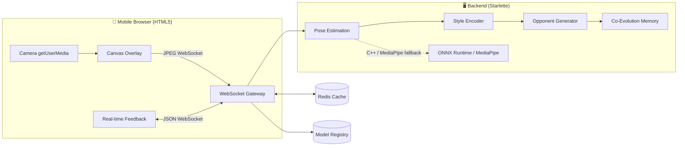

# 🥋 HADIN-COMBAT

> **The AI Opponent That Learns Your Fighting DNA** — *"Unlock the hidden techniques within you"*


**HADIN** = **HA**ssan + **DIN**a — a perfect fusion of our names, just as HADIN-COMBAT fuses human skill with machine intelligence. Created by **Al-hassan Shehade & Dina Balcheh**.

---

## 📖 The HADIN Philosophy

Every fighter has a **fighting DNA** — a unique combination of stance, timing, rhythm, footwork, and instincts. Traditional training partners repeat patterns; they don't adapt to *you*. HADIN-COMBAT is the first platform whose **AI opponent actually learns your movements**, extracts your signature style, and evolves to challenge the *specific* weaknesses in your game.

- **It watches.** Real-time pose estimation captures your skeleton from a phone camera.
- **It understands.** A neural style autoencoder compresses your movement into a latent "fighting DNA" fingerprint.
- **It adapts.** An opponent generator turns that fingerprint into an adversary calibrated to your level and tendencies.
- **It grows with you.** Co-evolution drives both you and the AI to improve across training sessions.

---

## 🏗️ Architecture



- **C++17/20 core** (`hadin_core`) — sub-50ms ONNX Runtime inference on mobile-class devices, exposed to Python via pybind11.
- **Pure-Python fallback** — if C++ compilation fails on a device, the backend transparently falls back to MediaPipe. The app keeps working.
- **Zero-install frontend** — any phone browser (Android or iOS) opens the server URL and trains immediately.

---

## ✨ Features

- 🧬 **Fighting DNA Extraction** — your movement style is encoded into a reusable latent fingerprint (`app/dna_encoder.py`).
- 🥊 **Adaptive Opponent** — the AI opponent adapts stance, tempo, and defense to counter you (`app/adaptive_opponent.py`).
- 🧠 **AI Coach** — real-time martial-arts movement detection (jab, cross, hook, uppercut, front/roundhouse kicks, **superman punch, spinning backfist, axe kick, question-mark kick**, guard, stance) each with a confidence score, plus technique counters, quality scoring, tempo and rotating professional coaching advice (`app/coach.py`).
- 😮‍💨 **Fatigue analysis** — real-time fatigue score 0–100 from strike-speed decay, reaction slowing and stance wobble, with recovery advice (`app/fatigue.py`).
- 🤖 **Sparring AI profiles** — switch mid-session between Balanced / Aggressive / Counter-Puncher / Defensive / Pressure Fighter opponents (`app/profiles.py`).
- 📈 **Performance dashboard** — post-training charts for technique mix, fatigue trend and profile usage, with personalised improvement suggestions (`/dashboard.html`, `/api/history`).
- 🖥️ **Live analysis panel** — real-time strike (with confidence %, quality & velocity), fatigue score, sparring profile, round/duration timer, movement-speed indicator and coaching tips right under the camera.
- 🐞 **Debug mode** — a one-tap toggle (button or `?debug=1`) that logs frame-by-frame what the system sees: camera state, every candidate detection with velocity/confidence, the exact gate decision, and each calibration sample. Moving the phone pauses detection (camera ego-motion gate) so it can never fabricate strikes.
- 🏆 **Match summary** — pressing Stop generates a full post-session report (strikes thrown/landed, accuracy %, most-used technique, reaction time, fatigue progression, performance score 0–100 and top-3 improvement tips).
- 🎬 **Video upload & analysis** — upload an MP4/MOV/AVI sparring clip on the dashboard; it is analysed offline frame-by-frame with a progress bar, a clickable strike timeline, and the same analytics — all stored in Session History.
- 🔊 **Voice coaching** — real-time verbal feedback via the browser's speech synthesis (optional toggle).
- 🧠 **Gemini global-AI coach** *(optional)* — streams camera frames to Google's **Gemini Multimodal Live API** (`gemini-2.0-flash-exp`) for a second-opinion on every frame, returning structured JSON (strike type, confidence, form score, short form/tactical cues, fatigue level) via function calling. **Fully optional and off by default** — it degrades gracefully to the local coach when no `GEMINI_API_KEY` is set, and offers a free local **simulation mode** (`GEMINI_COACH_MODE=simulate`) to demo the UI/pipeline with no key or network. See `app/gemini_coach.py`.
- 🔄 **Co-Evolution** — the opponent difficulty and framing genuinely grow
  with you: each finished session updates a persisted athlete profile
  (`python-backend/data/athlete_profile.json`) that drives the next session's
  difficulty (`app/coevolution.py`), so both you and the AI improve session
  over session.
- 📱 **Mobile-First** — thumb-friendly neon UI, works on any browser.
- 🚀 **One-Command Setup** on Android (Termux) — no manual steps.
- 📡 **Real-Time WebSockets** — sub-100ms latency for pose → movement → coach → opponent → feedback.
- 🧯 **Graceful Degradation** — if C++ compilation fails, the backend falls
  back to MediaPipe and then an OpenCV motion fallback. Opponent, style and
  co-evolution are pure Python (`app/engine.py`), so **the app is fully
  functional with no C++ and no ONNX models**. The C++ core is an optional
  accelerator for sub-50ms inference.
- 🧠 **Local & Private** — inference runs on your device/server; no cloud dependence.
- 🐳 **Docker Ready** — one command to deploy the full stack.

---

## 🚀 Quick Start

### 📱 Android (Termux)

```bash
# 1. (Optional) extra repos, then pre-built native binaries (never compiled):
pkg install -y x11-repo tur-repo
pkg update
pkg install -y python-numpy python-opencv clang

# 2. Clone and run the one-command setup:
git clone https://github.com/Al-hassan-961/hadin-combat.git
cd hadin-combat
bash scripts/termux_quickstart.sh
```

> 🔧 **Zero compilation on Android.** `numpy` and OpenCV are **system
> dependencies** (Termux `pkg` packages), never pip dependencies: they are
> completely absent from `install_requires`/`requirements.txt`, so pip never
> attempts a C source build (no ARM64 wheels for Python 3.14 → ninja
> `highway_qsort` crash). The venv is created with `--system-site-packages`
> so the pkg-installed numpy/OpenCV are visible. All other dependencies are
> pure-Python wheels.

The script installs dependencies, starts the server, and prints:

```
✅ Server running at http://<local-ip>:8000 – open this URL in your browser!
```

### 📱 iOS

No installation needed. Run the server on any machine (Termux, laptop, or Docker), then open the printed URL in Safari. The web app works out of the box.

> iSH Shell (Alpine Linux) users: `bash scripts/ish_quickstart.sh`

### 🐳 Docker

```bash
docker-compose up --build
```

Then open `http://localhost:8000`.

### 💻 Linux / macOS (development)

```bash
bash scripts/setup_dev.sh
```

---

## 🌐 Accessing from your phone / local network

The server binds to `0.0.0.0`, so **any device on the same Wi‑Fi** can open it.
When you start it via `run.sh` (the quickstarts call this automatically), it:

1. **Detects your local IP** and prints the exact URL.
2. Shows a **scannable QR code** (install `pkg install qrencode` on Termux) so you
   can open it on another phone with your camera.
3. Optionally opens your browser: `bash scripts/run.sh --open`.

```bash
# Same device / localhost:
bash scripts/run.sh --port 8000
# → http://127.0.0.1:8000   and   http://<your-lan-ip>:8000
```

Health check: `curl http://127.0.0.1:8000/api/health` → `{"status":"ok","version":"1.0.0",...}`

> 🔍 **Troubleshooting**
> - **Browser can't connect** → ensure you're on the same network, the phone's Wi‑Fi
>   isolation is off, and the firewall allows port `8000`.
> - **QR not shown** → `pkg install qrencode` then restart `run.sh`.
> - **"Camera unavailable" even with permission granted** → browsers block the
>   camera on plain `http://` for non-localhost addresses (a *secure-context*
>   rule). Fix: open **`http://127.0.0.1:8000` on this phone**, or run the
>   server with HTTPS for other devices: `bash scripts/run.sh --ssl` (accept
>   the self-signed certificate warning once).
> - **See `backend: opencv`** → that's the OpenCV motion fallback (works out of the
>   box). `mediapipe`/`cpp` appear when those are installed.

---

## 🧭 Next Steps

- **[Setup Guide](docs/SETUP.md)** — manual install on Linux, macOS, and Termux.
- **[Architecture](docs/ARCHITECTURE.md)** — data flow, latency, threading, and fallback mechanics.
- **[API Reference](docs/API_REFERENCE.md)** — WebSocket JSON schemas and REST endpoints.
- **[AI Models](docs/AI_MODELS.md)** — training the autoencoder, diffusion model, and PPO policy.
- **[Contribute](docs/CONTRIBUTING.md)** — code style, commit conventions, and PR process.

---

## 🧬 Models

Pre-trained ONNX models (pose, style encoder, opponent generator, co-evolution) can be downloaded from the [models directory](models/README.md). Place them under `models/` before first run, or the backend falls back to pure Python pose estimation so the app still works.

---

## 👥 Creators

| | |
|---|---|
| **Al-hassan Shehade** | [GitHub](https://github.com/Al-hassan-961) |
| **Dina Balcheh** | [GitHub](https://github.com/) |

> *"Just as HADIN fuses Hassan and Dina, this platform fuses human intuition with machine intelligence."*

---

## 📄 License

Released under the **MIT License**. Copyright (c) 2026 Al-hassan Shehade & Dina Balcheh. See [LICENSE](LICENSE).

---

## 🛠️ Tech Stack

| Layer | Technology |
|---|---|
| Core AI inference | C++17/20 · ONNX Runtime · pybind11 |
| Backend | Python 3.10+ · Starlette (ASGI) · WebSockets · OpenCV · MediaPipe |
| Frontend | HTML5 · CSS · JavaScript · Canvas · getUserMedia |
| Deployment | Docker Compose · uvicorn |
